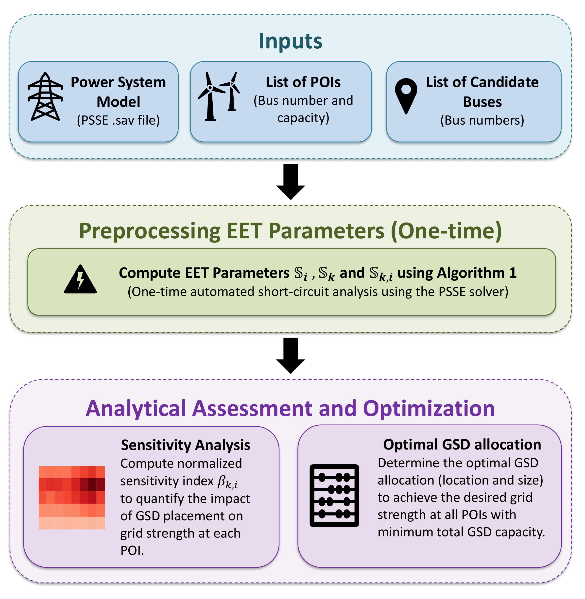

# ⚡ Automated System-wide Strength Evaluation Tool (ASSET)

**ASSET** is a free and open-source Python-based tool for **grid-strength assessment, sensitivity analysis, and grid-strengthening planning** in large-scale power systems using [PSS®E](https://www.siemens.com/global/en/products/energy/grid-software/planning/pss-software/pss-e.html). It automates Short-Circuit Ratio (SCR) analysis across multiple operating conditions and contingencies and uses the **Extra Element Theorem (EET)** for sensitivity analysis and the optimal sizing and placement of grid-strengthening devices (GSDs).

ASSET provides modular workflows and tabular outputs that support efficient analysis, visualization, and planning for large power-system models.

**National Laboratory of the Rockies Software Record Number: SWR-24-03**

---

## 🚀 Features

- ✅ **Automated grid-strength assessment** at a user-defined list of buses or points of interconnection (POIs).
- 🧮 **Multiple SCR analysis modes**, including base-case SCR, interaction-factor-based SCR (SCRIF), critical N-1/N-2 analysis, and user-defined contingency scans.
- ⚠️ **Critical-contingency identification** to determine the network outages with the greatest impact on grid strength.
- 🔗 **Interaction-aware assessment** using SCRIF to account for voltage sensitivity among neighboring POIs.
- 🔍 **EET-based sensitivity analysis** to quantify how GSD placement at candidate buses affects grid strength at each POI.
- 📍 **Optimal GSD allocation** to determine device locations and sizes that meet the desired grid strength with minimum total GSD capacity.
- 🎛️ **Interactive manual GSD tuning** for exploring candidate allocations and comparing resulting SCR values.
- 📊 **Analysis-ready outputs**, including CSV results, sensitivity heatmaps, gamma plots, and GSD allocation comparisons.

---

## 🖼️ Workflow Overview

ASSET contains two complementary workflows: one for system-wide grid-strength assessment and another for EET-based sensitivity analysis and GSD allocation.

### Grid-Strength Analysis


### EET-Based GSD Allocation



The EET workflow performs the required PSS®E short-circuit simulations once to compute the EET parameters. These parameters are then used for fast analytical sensitivity assessment and optimization without repeated short-circuit simulations for every candidate allocation.

---

## 🧭 Analysis Workflows

### 1. SCR Workflow (`main.py`)

Select the analysis mode using `GUIinput_SimMode`:

| Mode | Analysis | Description |
|:---:|---|---|
| `0` | Base SCR (N-0) | Computes base-case SCR and short-circuit MVA at the selected POIs. |
| `1` | SCRIF | Computes interaction-factor-based SCR by accounting for coupling among POIs. |
| `2` | Critical N-1/N-2 SCR | Identifies critical single- and double-element contingencies affecting grid strength. |
| `3` | Contingency scan | Evaluates contingencies defined in CSV files within the `ctg/` directory. |

Mode-specific SCR and short-circuit MVA results are written to `output/`.

### 2. EET Workflow (`EET_implementation.py`)

Select the analysis mode using `GUIinput_EET_Mode`:

| Mode | Analysis | Description |
|:---:|---|---|
| `1` | Sensitivity analysis | Computes EET parameters, sensitivity indices, and gamma metrics. |
| `2` | Optimal GSD sizing and placement | Performs sensitivity analysis and optimization-based GSD allocation. |
| `3` | Manual GSD tuning | Provides an interactive slider interface for manual allocation and SCR comparison. |

EET results are written to `output_EET/`.

---

## 📁 Repository Structure

```text
ASSET/
├── main.py                         # Unified SCR analysis workflow
├── EET_implementation.py           # EET sensitivity and GSD allocation workflow
├── assetlib.py                     # Core SCR, contingency, and EET computations
├── offtheshlef_optimization.py     # Optimization routines used by EET mode 2
├── input/                          # Power-system cases and CSV inputs
├── ctg/                            # Contingency definition files
├── output/                         # SCR workflow results
├── output_EET/                     # EET workflow results
└── pssepath/                       # Local PSS®E path helpers
```

---

## ⚙️ Requirements

- Windows with PSS®E installed and licensed
- A Python environment compatible with the installed PSS®E version
- The following Python packages:
  - `numpy`
  - `pandas`
  - `matplotlib`
  - `seaborn`
  - `scipy` (required for optimization mode)

> [!IMPORTANT]
> The scripts currently use explicit PSS®E paths. Before running ASSET, verify the `PSSE_Path` and `PSSPY_Path` variables in `main.py`, `EET_implementation.py`, and `assetlib.py`.

---

## 📥 Installation

Clone the repository:

```bash
git clone https://github.com/NatLabRockies/ASSET.git
cd ASSET
```

Install the required Python packages in the environment associated with your PSS®E installation:

```bash
pip install numpy pandas matplotlib seaborn scipy
```

---

## ▶️ How to Run

### Run the SCR Workflow

1. Configure the following variables in `main.py`:
   - `GUIinput_powerflowfile`
   - `GUIinput_poidata`
   - `GUIinput_outputfolder`
   - `GUIinput_contfolder` (mode `3` only)
   - `GUIinput_SimMode`
2. Run:

```bash
python main.py
```

### Run the EET Workflow

1. Configure the following variables in `EET_implementation.py`:
   - `GUIinput_powerflowfile`
   - `GUIinput_poidata`
   - `GUIinput_candidate`
   - `GUIinput_outputfolder`
   - `GUIinput_EET_Mode`
2. Run:

```bash
python EET_implementation.py
```

---

## 📄 Input Data

The workflows use CSV input files with the column names included in the repository examples.

- **POI data:** must include `POI bus #` and `MW capacity`.
- **Candidate-bus data:** must include `Candidate bus #`.
- **Contingency data:** for SCR mode `3`, place compatible contingency definition CSV files in `ctg/`.

---

## 📊 Outputs

The SCR workflow generates mode-specific SCR and short-circuit MVA CSV files in `output/`.

Typical EET outputs in `output_EET/` include:

- `result_S_i0.csv`
- `result_SCR_i0.csv`
- `result_S_k0.csv`
- `result_S_ki_matrix.csv`
- `result_Sensitivity.csv`
- `result_Gamma_max_improvement.csv`
- `sensitivity_heatmap.png`
- `gamma_heatmap_log1p.png`
- `result_GSD_sizing.csv` (mode `2`)
- `result_GSD_manual_values.csv` (mode `3`)
- `result_SCR_manual_comparison.csv` (mode `3`)
- `manual_gsd_scr_comparison.png` (mode `3`)

---

## 🌐 Applications

ASSET has been used to study real-world power systems, including:

1. [Grid-strength studies for the U.S. Eastern Interconnection](https://www.nrel.gov/docs/fy24osti/88003.pdf) 🌐
2. [Puerto Rico grid-resilience studies](https://www.nrel.gov/docs/fy24osti/88615.pdf) 🇵🇷
3. [Grid-strength studies for the U.S. Western Interconnection (WECC)](https://www.osti.gov/servlets/purl/2500279/) 🌐
4. [Subnational strategies to improve grid quality and reduce energy costs in Argentina](https://www.nrel.gov/docs/fy25osti/91767.pdf) 🇦🇷

---

## 📚 Citation

If you use ASSET in your research or publications, please cite:

```text
P. Sharma and S. Shah, "Sizing and Placement of Grid Strengthening Devices Using Extra Element Theorem," IEEE Open Access Journal of Power and Energy, 2026, doi: 10.1109/OAJPE.2026.3732363.

P. Sharma and S. Shah, "Application of the Extra Element Theorem for Grid Strength Analysis in IBR-Dominated Systems," 2025 IEEE Power & Energy Society General Meeting (PESGM), Austin, TX, USA, 2025.
```

---

## 📝 License

ASSET is distributed under the permissive license included at the top of the core source files.

Copyright © 2026 Alliance for Energy Innovation, LLC.

**Software Record of Invention**  
Pranav Sharma, and Shahil Shah, “Automated System-wide Strength Evaluation Tool (ASSET).”

---

## ✉️ Contact

For questions, feedback, or collaboration inquiries, contact **shahil.shah@nlr.gov**.

For related work in power-system stability, visit the [Grid Impedance Scan Tool](https://www.nrel.gov/grid/impedance-measurement).

---

## 🤝 Contributing

Contributions to the code, documentation, testing, and feature development are welcome.

1. Fork the repository and create a branch from `main`.
2. Commit your changes with a clear description.
3. Open a pull request explaining what you changed and why.
4. A maintainer will review the contribution and suggest any necessary revisions.

To discuss a proposed feature before implementation, open a GitHub issue or contact the maintainers.

> New to GitHub? See GitHub's guide to [forking a repository](https://docs.github.com/en/get-started/quickstart/fork-a-repo).

Thank you for helping improve ASSET!
